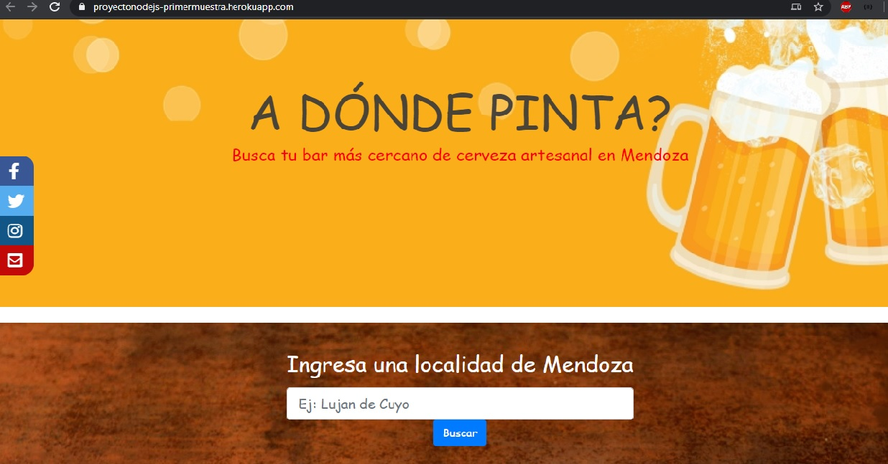

<h1>Proyecto Final de Curso Node.Js</h1>

Primer muestra

MPV de  proyecto NodeJs  y Express . La idea del proyecto consiste en la realizacion de una pagina web montada sobre un servidor local que brinde informacion acerca de bares en la ciudad de Mendoza en los que se pueda ir a tomar cerveza artesanal.

DEPLOY EN HEROKU https://proyectonodejs-primermuestra.herokuapp.com/

Imagen Demo
</img>

**Para el desarrollo utilice:**
<ul>
<li>Etiquetas HTML</li>
<li>Estilos CSS</li>
<li>Boostrap</li>
<li>Flexbox</li>
<li>Node.Js</li>
<li>Express (nodemon handlebar)</li> 
</ul>

***Tareas a Realizar***
-Terminar footer
-Agregar mas datos Json
-Crear login
-Hacer responsive completa

